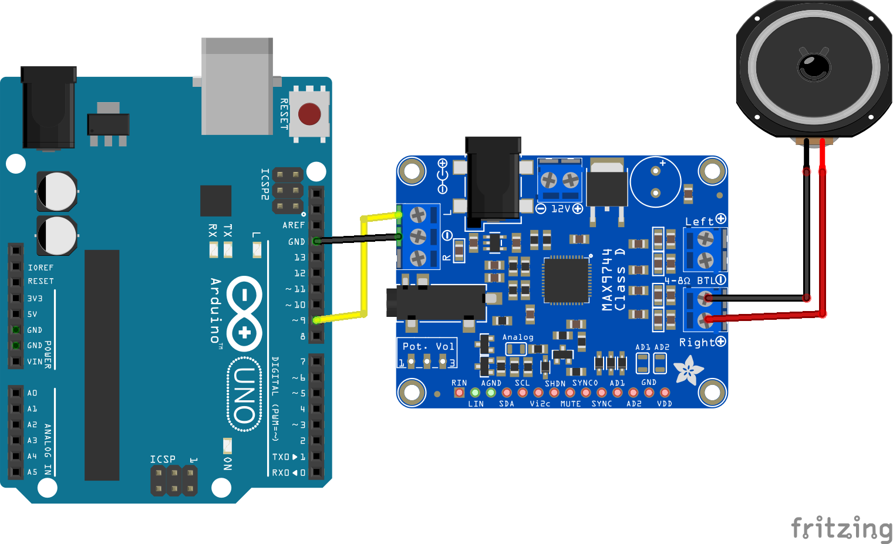

# Sound emitter
----
### DESCRIPTION

This project turns an Arduino UNO into a simple sound source.

----
### HARDWARE

- Arduino UNO
- MAX9744 Amplifier board
- 12V Power Supply
- Transducer speaker or Cone speaker
- Small screwdriver

----
### WIRING



- Connect the module to the Arduino UNO and the speaker.

- Connect the digital pin to the positive terminal of the input (L).

- Power the Amplifier using the 12V Power Supply

---
### CODE and INSTRUCTIONS

- Upload the following code into your Arduino Board (or download [here](https://github.com/kingston-hackSpace/Making-a-sound-emitter-with-Arduino-and-amplifier/blob/main/accoustic_driver.ino))

```
const int tonePin = 9; // Digital pin connected to MAX9744 audio input

void setup() {
  // No special setup needed for tone() on this pin
}

void loop() {
  // Play a 1000 Hz tone for 500 milliseconds
  tone(tonePin, 1000, 500);
  delay(1000);
}

```
---
### UNDERSTANDING THE CODE: Generating a signal

The code makes use of the ***Tone*** command to generate a signal from the digital pin. Other methods for generating a signal are possible using combinations of digital write commands.

An mp3 shield to generate a sound signal. More about this can be found [here](https://github.com/kingston-hackSpace/MP3_shield_with_ultrasonic_sensors)
